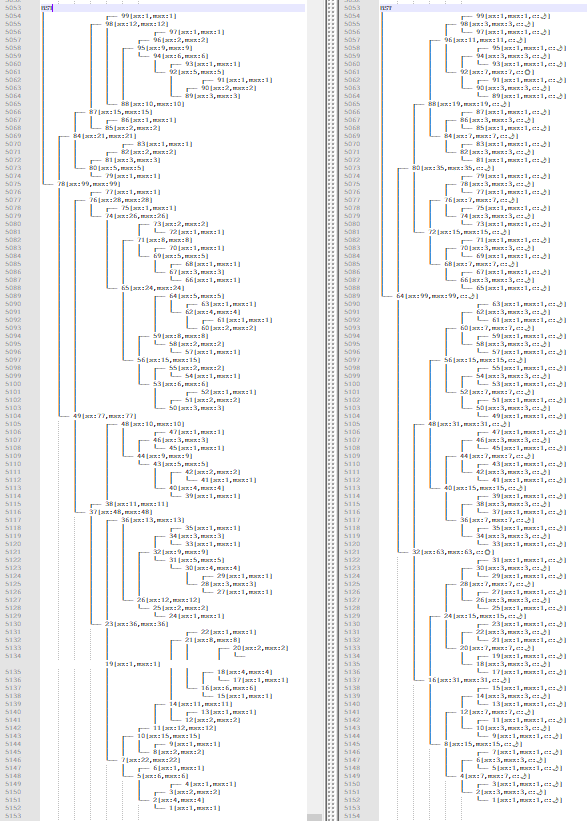

# codeforces-go 💭💡🎈

## Algorithm

Gain more power at [OI-wiki](https://oi-wiki.org/graph/min-circle/)

[OI-wiki List](https://github.com/OI-wiki/OI-wiki/issues/187)

## How to Choose Problems

> Notice that sorting problems by the rating also sorts problems with the same rating by solving amount. So, I would say; Choose a rating (for example, I would choose 1400 for you for now); Sort by the rating; And, finally, start solving from the most solved 1400.
>
> If you feel that rating X is easy enough for you, check if you can solve least solved problems with X rating. Surely, you don't have to solve all problems with rating X, there are tons of them. Just step to X+100 when you feel ready.
>
> Good luck!
>
> [source](https://codeforces.com/blog/entry/65406?#comment-494043)

## Rating

[Open Codeforces Rating System](https://codeforces.com/blog/entry/20762)

[Codeforces Visualizer](https://cfviz.netlify.com/virtual-rating-change.html)

## Tips

[OEIS](https://oeis.org/)

## BST

> Binary search tree (BST) based data structures, such as AVL trees, red-black trees, and splay trees, are often used in system software, such as operating system kernels. 
> Choosing the right kind of tree can impact performance significantly, but the literature offers few empirical studies for guidance. 
> We compare 20 BST variants using three experiments in real-world scenarios with real and artificial workloads. 
> The results indicate that when input is expected to be randomly ordered with occasional runs of sorted order, red-black trees are preferred; 
> when insertions often occur in sorted order, AVL trees excel for later random access, whereas splay trees perform best for later sequential or clustered access. 
> **For node representations, use of parent pointers is shown to be the fastest choice**, with threaded nodes a close second choice that saves memory; nodes without parent pointers or threads suffer when traversal and modification are combined; maintaining a in-order doubly linked list is advantageous when traversal is very common; and right-threaded nodes perform poorly.
>
> See [Performance Analysis of BSTs in System Software](misc/Performance%20Analysis%20of%20BSTs%20in%20System%20Software.pdf) for more detail.

left: treap (xorshift32 random number)

right: red black tree

